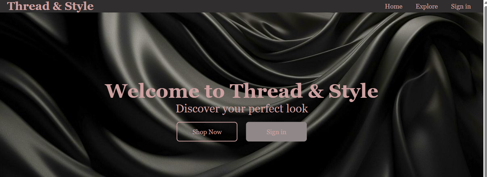

# thread-style-shop
# 🛍️ Thread & Style

An **online shopping website** built with **HTML & CSS** for browsing and purchasing clothes.  
This project was created as part of our web development learning journey and showcases responsive design fundamentals.

---

## 🚀 Features
- 🏠 **Home Page** – welcoming landing page with shop introduction  
- 🔎 **Explore Page** – browse clothing items  
- 🔑 **Sign-in Page** – simple registration form for buyers & sellers  

---

## 🛠️ Tech Stack
- **HTML5**  
- **CSS3**

---

## 📸 Screenshots


---

## 🌐 Live Demo
👉 [Visit the website](https://thread-style.netlify.app/)  

---

## 👥 Authors
This project was built with collaboration:  
- Kalkidan Asdesach
- Ruhama Beshada

---

## 🔮 Future Improvements
- Add **JavaScript functionality** (dynamic interactivity)  
- Build a **shopping cart system**  
- Integrate **backend & database** for orders and authentication  

---

## 🖥️ How to Run
Simply visit the **[live demo link](https://thread-style.netlify.app/)** in your browser.  
Or, clone this repository and open `index.html` locally:

```bash
git clone https://github.com/kal1kidan/thread-style.git
cd thread-and-style
open index.html